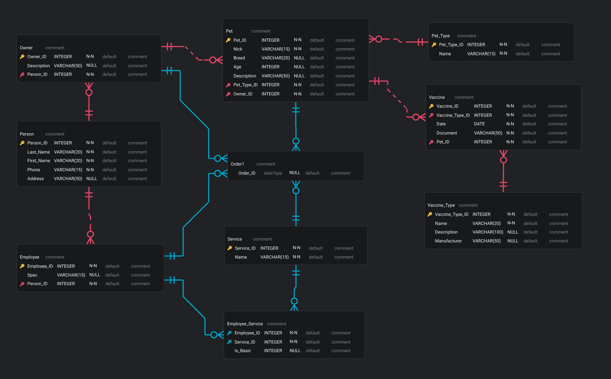

# Pet Salon Database
[](https://www.mysql.com/)
[](LICENSE)
[](https://github.com/Gitubrr/PetSalonDatabase_HW/actions/workflows/build.yaml)

Database for a pet salon

## Database structure

- **Person** — people (owners and employees)
- **Owner** — pet owners
- **Employee** — employees
- **Pet_Type** — types of animals (dog, cat, etc.)s
- **Pet** — pets
- **Service** — services
- **Employee_Service** — employee skills
- **Order1** — orders for services
- **Vaccine_Type** — directory of vaccine types
- **Vaccine** — vaccination log

## ERD diagram



## Installation

Create a database and import data
```bash
mysql -u root -p < src/init.sql
```
