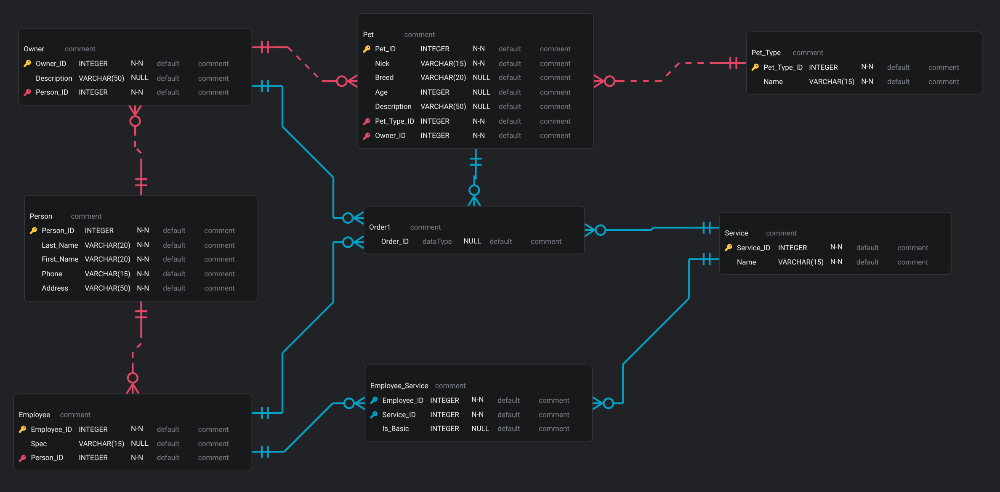

# Pet Salon Database
[](https://www.mysql.com/)
[](LICENSE)
[](https://github.com/Gitubrr/mySQL_WH/actions/workflows/test.yaml)
[](https://github.com/Gitubrr/mySQL_WH/actions/workflows/lint.yamls)

Database for a pet salon

## Database structure

- **Person** — people (owners and employees)
- **Owner** — pet owners
- **Employee** — employees
- **Pet_Type** — types of animals (dog, cat, etc.)s
- **Pet** — pets
- **Service** — services
- **Employee_Service** — employee skills
- **Order1** — orders for services

## ERD diagram



## Installation

Create a database
```bash
mysql -u root -p -e "CREATE DATABASE pet_db CHARACTER SET utf8mb4 COLLATE utf8mb4_unicode_ci;"
```
Import structure and data
```bash
mysql -u root -p pet_db < sql/pets.sql
```